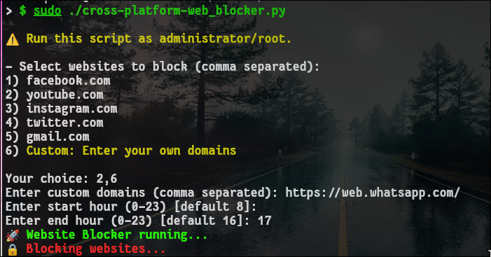
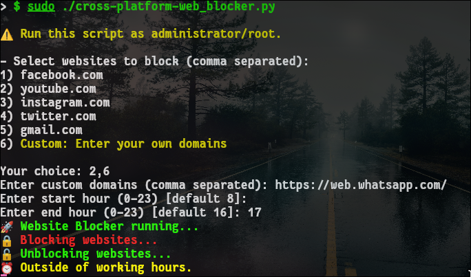

# Website Blocker


## Overview

This project is a Python-based website blocker that restricts access to selected websites during specified working hours. It modifies the system's hosts file to redirect targeted domains to the local machine, effectively preventing access.

The script supports both Unix-based systems and Windows by dynamically detecting the operating system and selecting the appropriate hosts file.


## Features
* Cross-platform support (Linux, macOS, Windows)
* Time-based website blocking
* Interactive selection of popular websites
* Support for custom user-defined domains
* Automatic cleanup of hosts file on exit
* Error handling for insufficient permissions
* Modular, object-oriented design


## How It Works

The program modifies the system's hosts file by adding entries that redirect selected domains (e.g., facebook.com) to 127.0.0.1. This prevents the browser from reaching the actual website.

During non-working hours, the script restores the hosts file by removing those entries.

This could be very useful for system administrators, parents, or anyone looking to improve productivity by limiting access to distracting websites during certain hours.


## Requirements

Python 3.x
Administrator/root privileges (required to modify the hosts file)


## Usage


1. Run the script

On Linux/macOS:
```bash
sudo python3 web_blocker.py
```

On Windows (run terminal as Administrator):
```bash
python web_blocker.py
```


2. Select websites
You will be prompted to:
* Choose from a list of common websites
* Or enter custom domains


3. Set working hours
Enter:
* Start hour (0–23)
* End hour (0–23)

If invalid input is provided, default values (8–16) will be used.


## Example





If you select:
* facebook.com
* youtube.com

The script will add entries like to the hosts file:
```bash
127.0.0.1 facebook.com
127.0.0.1 www.facebook.com
```

## Important Notes
* The script must be run with administrator/root privileges.
* Modifying the hosts file affects system-wide network behavior.
* The program automatically restores the hosts file when it is stopped using Ctrl+C.


## Improvements Over Original Implementation
* Refactored into an object-oriented design
* Added cross-platform compatibility
* Introduced interactive user input
* Improved timing responsiveness
* Added safe cleanup on exit
* Improved error handling and reliability


## Future Improvements
* Command-line arguments support
* Configuration file for persistent settings
* Logging system
* Unit testing


## Fixing 

* Instead of the program print status even if nothing changed, the program remembers its state and only acts when something actually changes.


1.  Admin / Root Check (Early Exit)

* Added a `check_admin()` function.
* Script now **verifies permissions before doing anything**.
* If not run as admin/root → exits immediately with a clear message.


2.  State-Based Execution (No Spam)

* Introduced `self.is_blocked` as a state flag.
* Script now:

  * ✅ Prints **only when state changes**
  * ❌ No repeated "Blocking..." / "Unblocking..." messages
* Behavior is now **event-driven**, not repetitive polling output.


3.  Initial State Synchronization

* On startup, script immediately:

  * Checks current time
  * Applies correct state (block/unblock)
  * Prints status **once**


4.  Safe Cleanup on Exit (Ctrl + C)

* Added `cleanup()` handler using `signal`
* On exit:

  * Automatically **unblocks websites**
  * Prevents leaving system in blocked state
* Ensures **safe and clean shutdown**


5.  Improved Error Handling

* Centralized permission error handling (`admin_error()`)
* Added:

  * Graceful handling for `PermissionError`
  * Catch-all for unexpected exceptions
* Prevents crashes → shows user-friendly messages


6.  Loop Optimization

* Changed polling interval:

  * From frequent checks → `time.sleep(60)`
* Reduces unnecessary CPU usage and file operations


7.  Terminal Output Improvements

* Kept ANSI colors for:

  * Errors (red)
  * Success (green)
  * Info (yellow/cyan)
* Output is now **cleaner and more meaningful**


* Added validation for:

  * Hour inputs (0–23)
* Falls back to defaults if input is invalid


The script is now:

* ✔ More **robust**
* ✔ More **user-friendly**
* ✔ More **efficient**
* ✔ Safer to run (no leftover blocking)
* ✔ Structured like a **real background service**


> **State-driven system service (mini daemon)**

Instead of blindly looping, it:

* Detects changes
* Reacts only when needed
* Maintains consistent system state


## License

This project is part of a public repository intended for educational and practical use.
